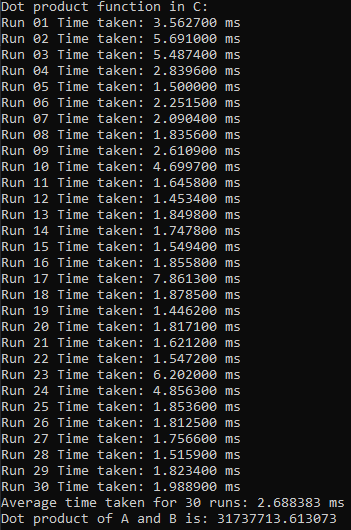

# CEPARCO MP1
### S11 Group 6
### Javier, Juan Diego V. | Kho, John Zechariah S. | Tumalad, Shawne Michael Q.

## Program
This program computes the dot product by iterating through each element of the two input arrays, multiplying corresponding elements together, and summing up all the products.
  The function is made in 4 different versions:
* a C function
* an x86 function
* an xmm function
* a ymm function

Each function was run 30 times and the time it took for each run is averaged.

The image showing the C function averaging process is identical to the other 3 functions shown in the program

## Results and Analysis
### Array size 2^20
#### Debug

#### Release

#### Comparison table
| Average Runtime in ms | C | x86 | XMM | YMM |
| - | - | - | - | - |
| Debug | 4.420053 | 3.485913 | 1.549047 | 1.377023 |
| Release | 2.688383 | 2.496110 | 2.178513 | 1.905723 |

For an array size of 2^20, the YMM implementation consistently shows the best performance in both Debug and Release modes, closely followed by XMM, x86, and then C. The speedup from using YMM over C is notable, with YMM being approximately three times faster in Debug mode and faster in Release mode. The SIMD implementations clearly benefit from parallel data processing, reducing computational time significantly compared to scalar x86 and C implementations.

It is also shown that there is a minor discrepancy in the decimals from the xmm and ymm functions. The different decimal places of the dot product results between XMM and YMM can be ascribed to the rounding behaviors and precision of IEEE-754 floating-point arithmetic. When compared to XMM, the wider YMM registers process more data concurrently, which can change the way rounding errors accumulate and produce slightly different outcomes. This would be more present in higher array sizes

Despite the decimal discrepancies, the percent error shows 0% as the difference is so marginal it is considered 0. Using the formula in a scientific calculator gave us a value that 10^-xx where xx was around 8 to 11 depending on the value. This result is negligible.

The boundary handling test assumes that the array size is a multiple of 2 which is always the case with the given array sizes in the MP specifications. Subtracting values 1 to 3 from the array size and using that value in the dot product functions allows them to perform the dot product with less elements despite the array having more, thus simulating a boundary handling problem.

The results shown are identical to the C function despite the minor decimal discrepancies

### Array size 2^26
#### Debug

#### Release

#### Comparison table
| Average Runtime in ms | C | x86 | XMM | YMM |
| - | - | - | - | - |
| Debug | 201.624820 | 136.3880q53 | 89.870213 | 77.702683 |
| Release | 88.977820 | 119.052030 | 84.965710 | 70.788297 |

For this larger array size, YMM maintains its lead in performance in both Debug and Release modes, followed by XMM, x86, and C. The runtime increases substantially for all implementations compared to the smaller array size, but the rate of increase is lower for YMM and XMM, highlighting their scalability and efficiency in handling larger data volumes. It is also shown that C is significantly faster than x86 in release. This is because of the code optimizations the IDE does, making the function faster.

The decimal discrepancies are more obvious than before but still very marginal according to the percent error results of 0% and the boundary handling still holds true 

### Array size 2^28
#### Debug

#### Release

#### Comparison table
| Average Runtime in ms | C | x86 | XMM | YMM |
| - | - | - | - | - |
| Debug | 702.918997 | 493.658220 | 314.526787 | 282.809700 |
| Release | 419.571883 | 489.864893 | 333.865140 | 280.233303 |

When we tried 2^30, our laptop froze and so we went down to 2^28. Again, the Debug runtime of C is significantly slower than its Release runtime while the assembly versions showed minor differences
With an even larger array size, the trend continues with YMM showing the best performance and the decimal discprepancies getting higher but still marginal according to the percent error values. The release version of C is not that significantly faster than x86 indicating that the gap between the release optimizations and x86 becomes narrower the higher the array size. The boundary handling test is still working properly

## Result analysis and discussion
Analyzing the runtime data across different implementations (C, x86, XMM, YMM) and compilation modes (Debug and Release) reveals that SIMD implementations using YMM registers consistently offer the lowest runtimes, underscoring the performance superiority of wider registers that can process more data per cycle. Transitioning from Debug to Release mode significantly enhances performance across all methods, with the most notable improvements seen in the C implementation, suggesting that high-level C benefits extensively from compiler optimizations like inlining and loop unrolling. The assembly functions show minimal performance variability between Debug and Release modes, highlighting their performance reliance on inherent hardware capabilities rather than compiler enhancements, thus demonstrating the importance of choosing appropriate programming and optimization strategies based on specific performance needs and environmental contexts.

The main reasons for the performance differences between the x86 assembly implementations with XMM and YMM registers and the C code are related to how these techniques manage data and use CPU resources. The sequential memory access of the C implementation might not be as effective in making use of cache lines and data prefetching capabilities of contemporary CPUs. Multiple data points (two double-precision floats per XMM register) can be processed concurrently using SIMD (Single Instruction, Multiple Data) instructions when XMM registers are used. By using a single instruction to process several pieces of data at once, this improves throughput. 
The YMM-based implementation is the fastest because it maximizes the data processing capabilities of the CPU by using the widest registers available (YMM), minimizing loop iterations, and efficiently using memory and cache resources. Each instruction does more work in less time, leading to significant performance gains compared to the XMM implementation and especially over the traditional C implementation.
In conclusion, the YMM implementation leverages modern processor features more effectively, which explains its superior performance compared to the XMM implementation and much more so over the C code version. Because it minimizes loop iterations, makes optimal use of memory and cache resources, and maximizes the CPU's data processing capabilities by utilizing the widest registers (YMM), the YMM-based implementation is the fastest. There are noticeable performance gains over the XMM implementation and especially over the conventional C implementation since each instruction completes more work in less time. In conclusion, the YMM implementation leverages modern processor features more effectively, which explains its superior performance compared to the XMM implementation and much more so over the C code version.

## Challenges
There were several obstacles to overcome when converting assembly code made in SASM to VSCode 2022. The use of different default registers from a groupmate's host machine added another layer in the adaptation of the SASM function to VS. Debugging assembly becomes more complex because of the low-level operations and challenges with data visualization associated with wider YMM registers. We primarily debugged the assembly code in SASM because it usually worked directly in VS. The challenges we experienced in that process was the proper use of the registers as sometimes we forgot to use address pointers and instead used the address values and vice versa. Implementing boundary handling was also a challenge as tried to figure out what was a very efficient way of performing it. The solution we came up with was using the AND operator to determine extra elements on the array.
